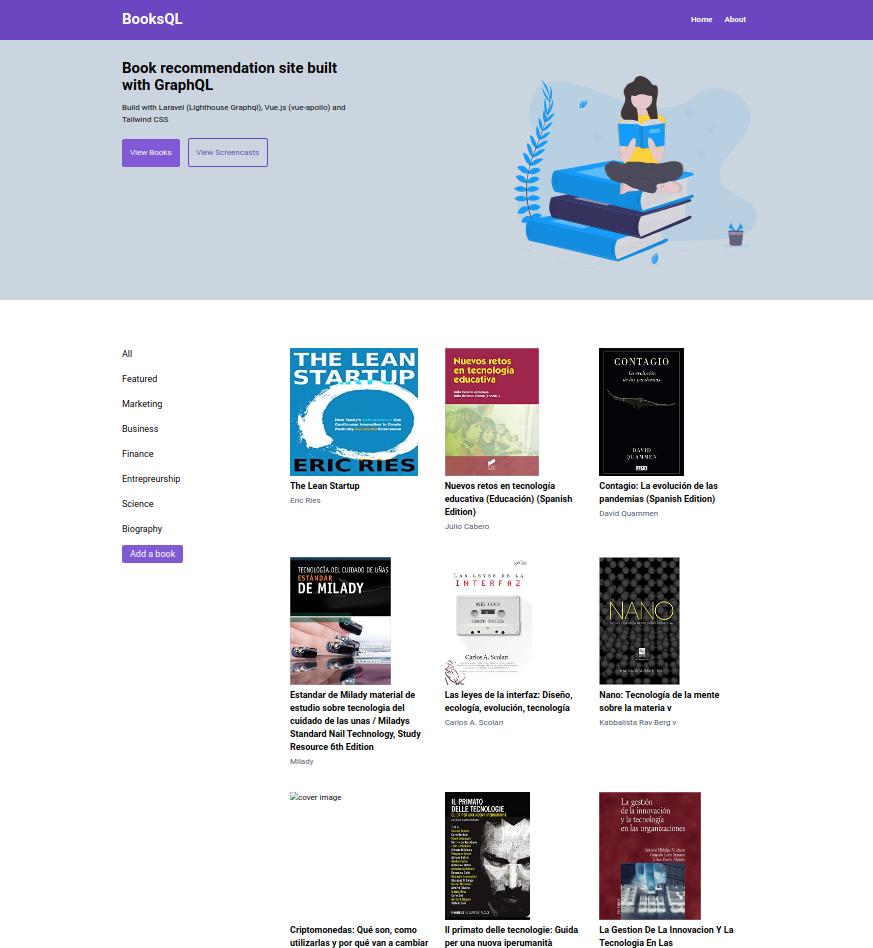

<h1 align="center">
    
</h1>

<h4 align="center"> 
	🚧 BooksQl 1.0 🚀 em construção... 🚧
</h4>

## 💻 Sobre o projeto

BooksQl é um simples site de recomendação de livros criado com o Laravel e Vue.Js com o GraphQl.

### Web

<p align="center" style="display: flex; align-items: flex-start; justify-content: center;">
    
</p>

## 🛠 Tecnologias

As seguintes ferramentas foram usadas na construção do projeto:

- [Laravel][laravel]
- [Lighthouse][lighthouse]
- [Tailwind][tailwind]
- [VueJS][vuejs]
- [Graphql][graphql]
- [Apollo][apollo]

## 🚀 Como rodar este projeto

Podemos considerar este projeto como sendo divido em duas partes:
1. Back End (pasta booksql-laravel) 
2. Front End (pasta booksql-vue)

💡 O Front End precisa que o Back End esteja em execução para funcionar.

### Pré-requisitos

Antes de começar, você vai precisar ter instalado em sua máquina as seguintes ferramentas:
[Git](https://git-scm.com), [Node.js][nodejs]. 
Além disto é bom ter um editor para trabalhar com o código como [VSCode][vscode]

### 🎲 Rodando o Back End (servidor)

```bash
# Clone este repositório
$ git clone https://github.com/thiagoalmeida88/booksql.git

# Acesse a pasta do projeto no terminal/cmd
$ cd booksql

# Vá para a pasta do back-end
$ cd booksql-laravel

# No arquivo .env trocar o nome do banco de dados desejado

# Criar as models
$ php artisan make:model Category -a
$ php artisan make:model Book -a

# Criar as migrations
$ php artisan migrate 

# Criar a classe para testes com base fictícia
$ php artisan make:seed CategoriesTableSeeder 
$ php artisan make:seed BooksTableSeeder

# Criar os dados das seeds
$ php artisan migrate:fresh --seed 

# Instalar o graphql tools para testar no localhost
$ composer require mll-lab/laravel-graphql-playground

#  Instalar o Lighthouse
$ composer require nuwave/lighthouse

# Publicar o arquivo de configuração do Lighthouse
$ php artisan vendor:publish --provider="Nuwave\Lighthouse\LighthouseServiceProvider" --tag=schema
$ php artisan vendor:publish --provider="Nuwave\Lighthouse\LighthouseServiceProvider" --tag=config

# Execute a aplicação 
$ php artisan serve

# O servidor inciará na porta:8000 - acesse http://localhost:8000/graphql-playground
```

### 🧭 Rodando a aplicação web (Front End)

```bash
# Clone este repositório
$ git clone https://github.com/thiagoalmeida88/booksql.git

# Acesse a pasta do projeto no seu terminal/cmd
$ cd booksql

# Vá para a pasta da aplicação Front End
$ cd booksql-vue

# Instale as dependências
$ npm install

# Instalar o vue-cli
$ npm install -g @vue/cli
$ npm update -g @vue/cli

# Verificar comandos úteis
$ vue 

# Gerar arquivo package.json
$ npm init --yes

# Instalar recursos úteis do vue CLI
$ npm install @vue/cli-shared-utils

# Adicionar o apollo server
$ vue add apollo 

# Rodar projeto vue
npm run serve

# A aplicação será aberta na porta:8080 - acesse http://localhost:8080/ 

```
## 😯 Como contribuir para o projeto

1. Faça um **fork** do projeto.
2. Crie uma nova branch com as suas alterações: `git checkout -b my-feature`
3. Salve as alterações e crie uma mensagem de commit contando o que você fez: `git commit -m "feature: My new feature"`
4. Envie as suas alterações: `git push origin my-feature`
> Caso tenha alguma dúvida confira este [guia de como contribuir no GitHub](https://github.com/firstcontributions/first-contributions)


## 📝 Licença

Este projeto está sobe a licença MIT. 

Feito com ❤️ por Thiago Almeida 👋🏽 [Entre em contato!](https://www.linkedin.com/in/thiagoalmeida1986/)

[laravel]: https://laravel.com/
[lighthouse]: https://lighthouse-php.com/
[tailwind]: https://tailwindcss.com/
[vuejs]: https://vuejs.org/
[graphql]: https://graphql.org/
[yarn]: https://yarnpkg.com/
[vscode]: https://code.visualstudio.com/
[license]: https://opensource.org/licenses/MIT
[nodejs]: https://nodejs.org/
[apollo]: https://www.apollographql.com/